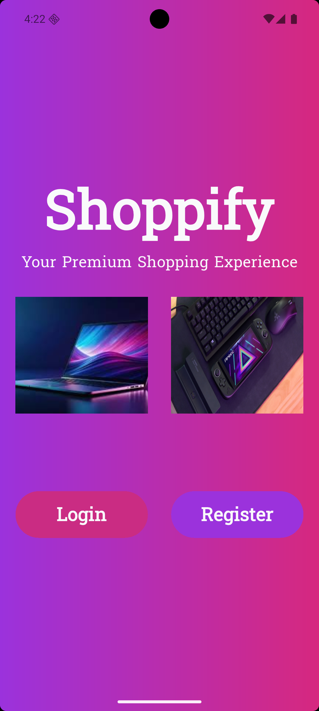
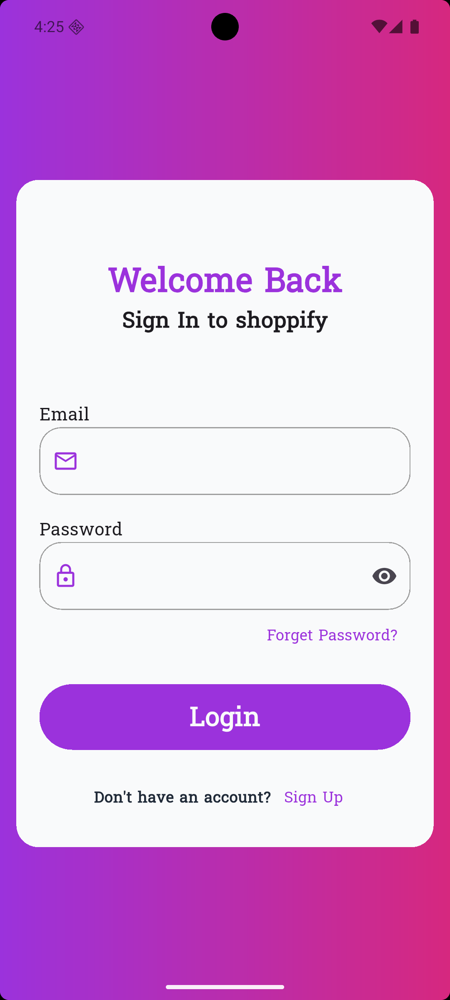
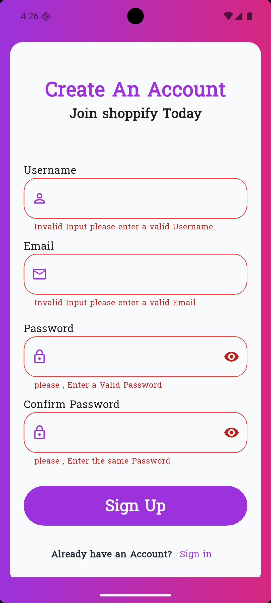

# Shoppify 🛍️

**Your Premium Shopping Experience**

A modern mobile e-commerce application built with a focus on electronics and tech gadgets, featuring a beautiful gradient UI and comprehensive shopping functionality.

## 📱 Screenshots

<div align="center">
  <div style="display: inline-block; margin: 10px;">
    
    <p><strong>Home Screen</strong></p>
  </div>
  <div style="display: inline-block; margin: 10px;">
    
    <p><strong>Login</strong></p>
  </div>
  <div style="display: inline-block; margin: 10px;">
    
    <p><strong>Sign Up</strong></p>
  </div>
  <div style="display: inline-block; margin: 10px;">
    
    <p><strong>Products</strong></p>
  </div>
  <div style="display: inline-block; margin: 10px;">
    
    <p><strong>Products</strong></p>
  </div>
</div>

## ✨ Features

### 🛒 **Core Shopping Experience**
- Browse featured products with high-quality images
- Product categories (Laptops, PC Cases, etc.)
- Detailed product listings with prices
- Shopping cart functionality
- Secure checkout process

### 🎨 **Modern UI/UX**
- Beautiful gradient backgrounds (Purple to Pink)
- Clean, intuitive interface
- Responsive mobile design
- Smooth animations and transitions
- Contemporary purple-themed branding

### 🔐 **User Authentication**
- User registration with email validation
- Secure login system
- Password confirmation
- "Forgot Password" functionality
- Form validation with error messages

### 💰 **Promotions & Offers**
- **50% OFF** electronics - Limited time offer on all tech gadgets
- **FREE SHIPPING** - No delivery charges on orders above $50
- **Buy 2 Get 1 Free** - On selected accessories and peripherals
- **Student Discount** - Extra 20% off with valid student ID

### 📦 **Product Categories**
- **Laptops** - Dell G15 ($700), HP Victus ($500)
- **PC Cases** - Asus ROG Case ($300), Asus Strix Case ($400)
- Gaming accessories and peripherals
- Tech gadgets and electronics

## 🛠️ Tech Stack

- **Frontend**: Flutter


## 🚀 Getting Started

### Prerequisites
```bash
- Flutter SDK (v3.0 or higher)
- Dart (v2.17 or higher)
- Android Studio / Vs Code
- Git
```

### Installation

 **Clone the repository**
```bash
git clone https://github.com/NooR-El-Deen-Ramadan/shoppify.git
cd shoppify
```


```

 **Font Setup**
```bash
# Make sure Suwannaphum font is properly installed
# For Flutter: Add to pubspec.yaml under fonts section
```

 **Environment Setup**
```bash
cp .env.example .env
# Configure your environment variables
```

 **Run the application**


```

For Flutter:
```bash
flutter run
```

## 📁 Project Structure

```
shoppify/
├── lib/
│   ├── main.dart              # App entry point
│   ├── widgets/               # Reusable UI components
│   ├── screens/               # App screens
│   │   ├── auth/              # Login, Register screens
│   │   ├── home/              # Main dashboard
│   │   ├── products/          # Product listing, details
│   │   └── cart/              # Shopping cart
│   ├── models/                # Data models
│   ├── services/              # API calls and business logic
│   ├── providers/             # State management
│   ├── utils/                 # Helper functions
│   └── config/                # App configuration
├── assets/
│   ├── images/                # App images
│   └── fonts/                 # Suwannaphum font files
├── pubspec.yaml               # Flutter dependencies
└── README.md
```

## 🎨 Design System

### Color Palette
- **Primary Gradient**: `linear-gradient(135deg, #8B5CF6 0%, #EC4899 100%)`
- **Purple**: `#8B5CF6`
- **Pink**: `#EC4899`
- **White**: `#FFFFFF`
- **Gray**: `#6B7280`

### Typography
- **Primary Font**: Suwannaphum
- **Headers**: Bold Suwannaphum for distinctive branding
- **Body Text**: Regular Suwannaphum for readability
- **Buttons**: Medium weight Suwannaphum, clean presentation

## 🔧 Configuration

### Environment Variables
```env
API_BASE_URL=https://api.shoppify.com
STRIPE_PUBLISHABLE_KEY=pk_test_...
GOOGLE_ANALYTICS_ID=GA_...
```

## 🤝 Contributing

1. Fork the repository
2. Create your feature branch (`git checkout -b feature/AmazingFeature`)
3. Commit your changes (`git commit -m 'Add some AmazingFeature'`)
4. Push to the branch (`git push origin feature/AmazingFeature`)
5. Open a Pull Request

## 📄 License

This project is licensed under the MIT License - see the [LICENSE.md](LICENSE.md) file for details.


## 📞 Support

For support and queries:
- 📧 Email: nooraldeinrmadan@gmail.com
- 🐛 Issues: [GitHub Issues](https://github.com/NooR-El-Deen-Ramadan/shoppify/issues)
- 💬 Discussions: [GitHub Discussions](https://github.com/NooR-El-Deen-Ramadan/shoppify/discussions)

## 🙏 Acknowledgments

- Design inspiration from modern e-commerce apps


---

**Made with ❤️ by [NooR El-Deen Ramadan](https://github.com/NooR-El-Deen-Ramadan)**

*Shoppify - Transforming mobile shopping experiences*
